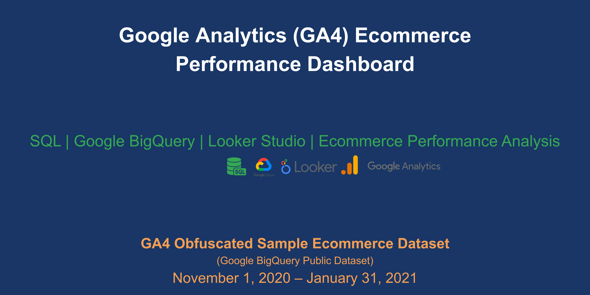

# GA4 Ecommerce Performance Analysis

An end-to-end ecommerce performance analysis using Google Analytics 4 (GA4), BigQuery, SQL, and Looker Studio to evaluate acquisition, conversion funnel performance, checkout behavior, landing page effectiveness, and performance trends.

## Project Overview

This project analyzes the ecommerce performance of the Google Merchandise Store using GA4 event-level data from the Google BigQuery Public Dataset.

The analysis covers a 92-day period from November 1, 2020 to January 31, 2021.

The objective is to identify performance drivers, customer journey friction points, and opportunities to improve conversion and revenue through data-driven decision-making.

## Business Objective

To analyze the end-to-end ecommerce performance of the Google Merchandise Store using GA4 data and identify opportunities to:

- Improve customer acquisition efficiency
- Increase conversion rates
- Reduce checkout abandonment
- Improve landing page performance
- Support sustainable revenue growth
