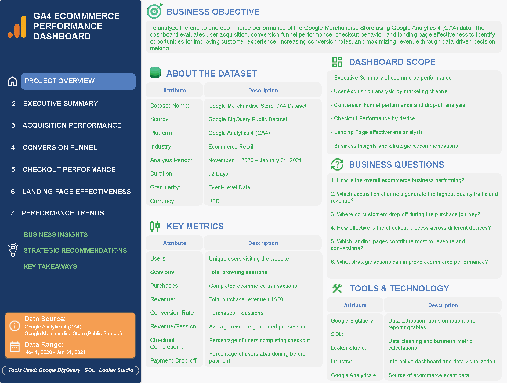
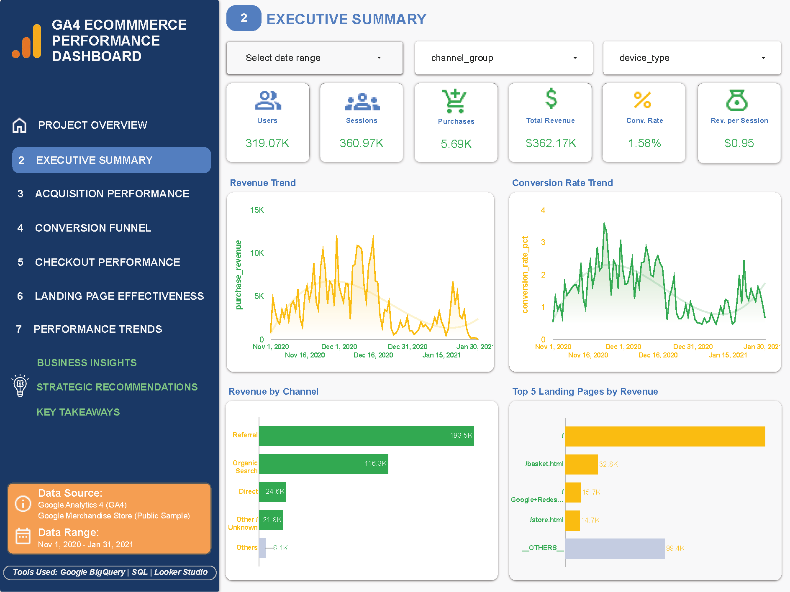
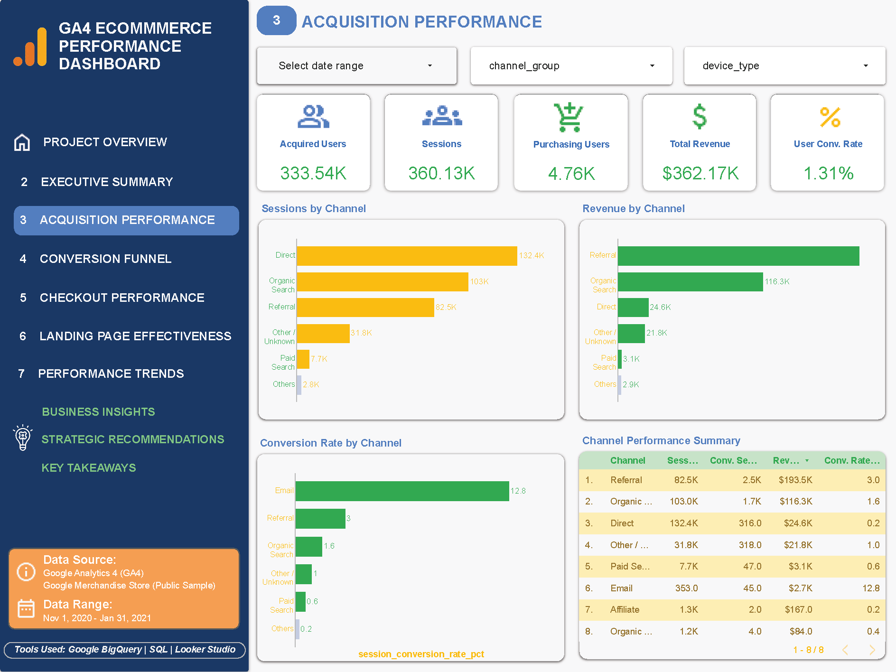
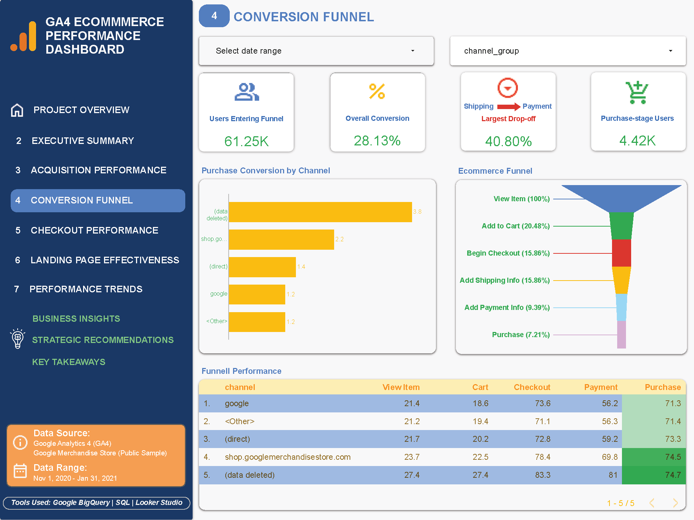
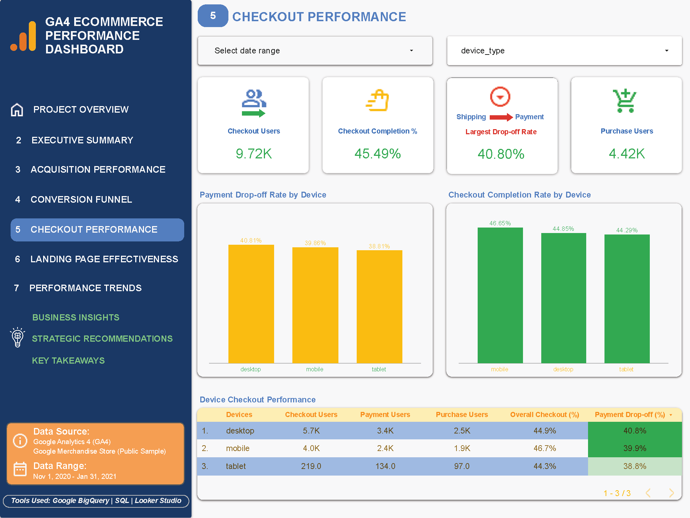
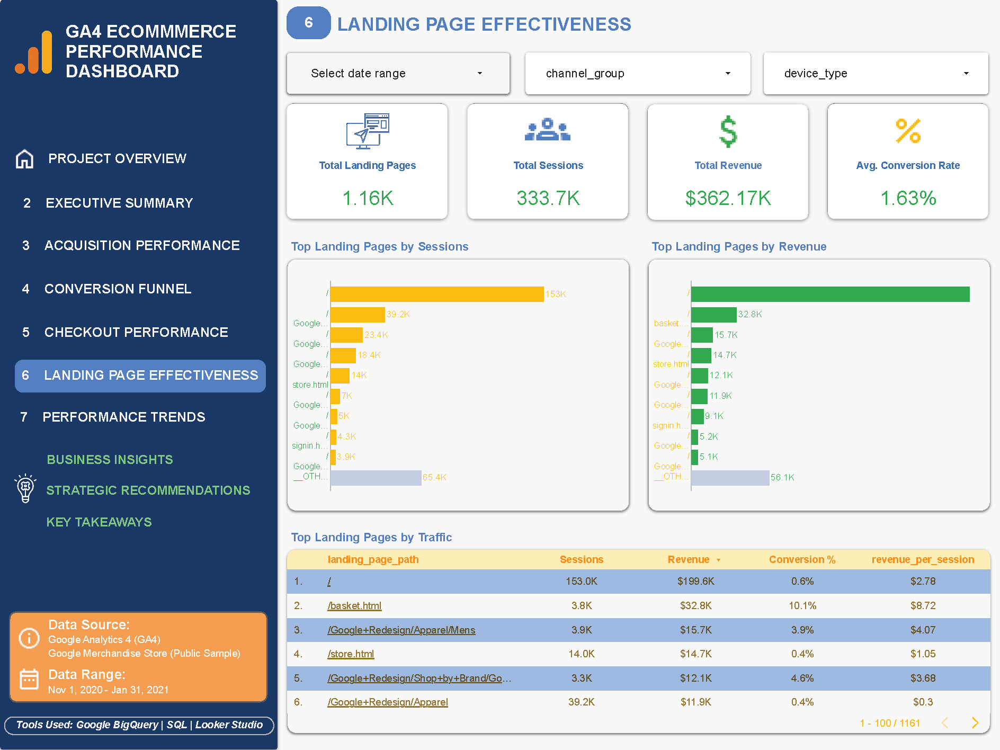
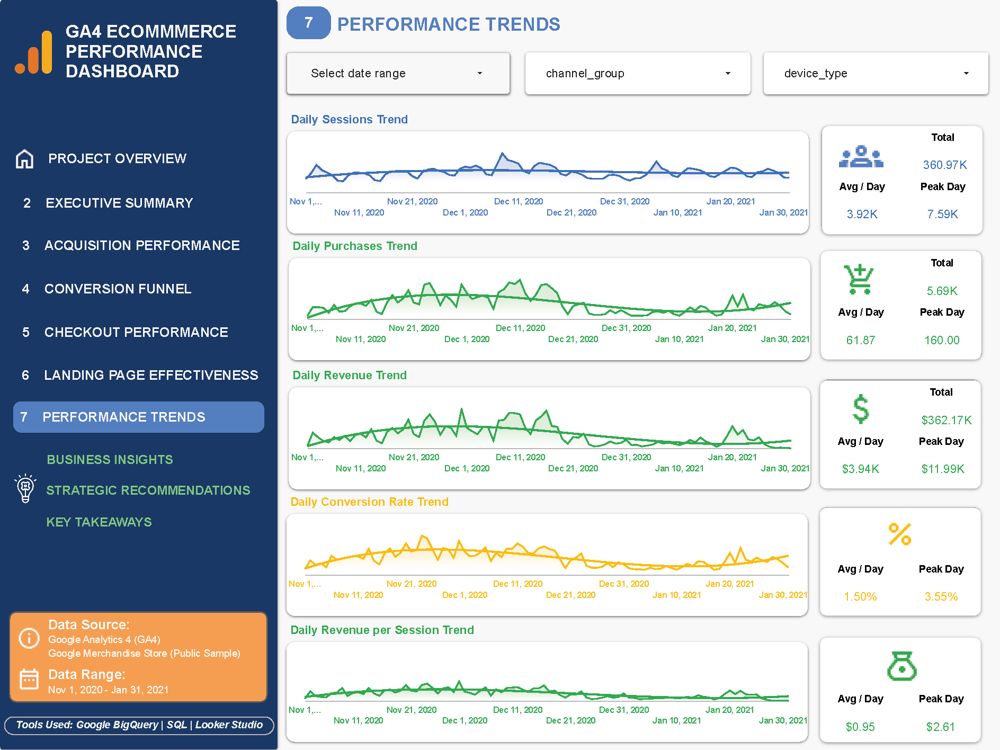
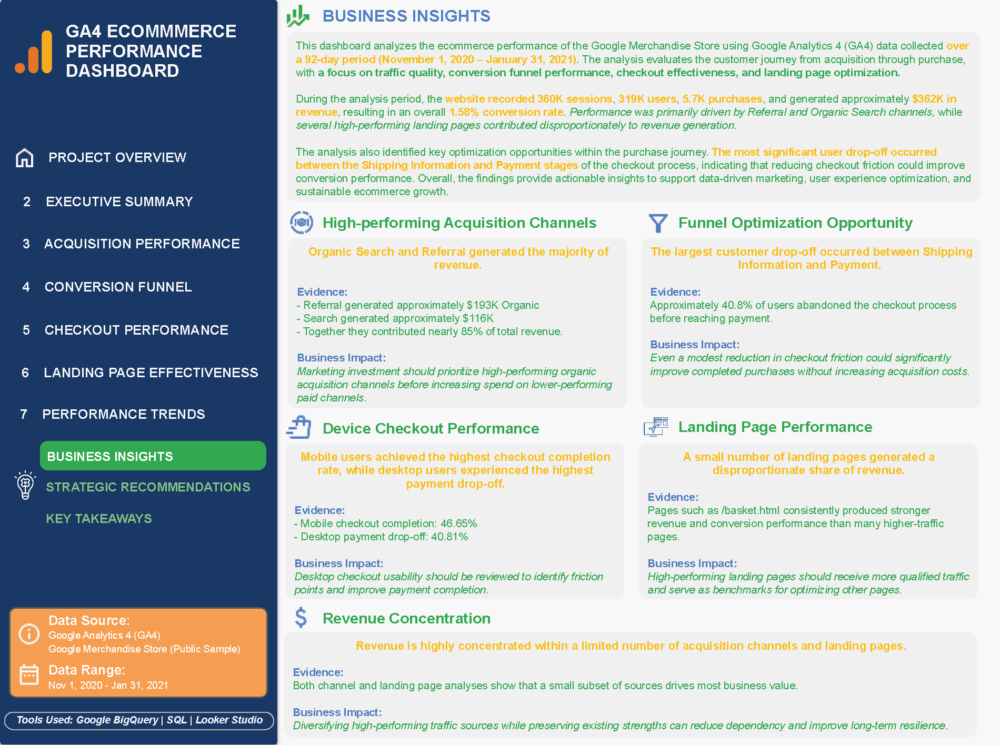
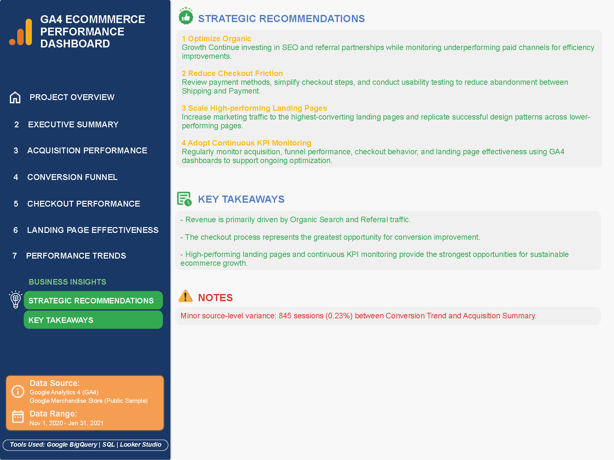

# GA4 Ecommerce Performance Analysis

An end-to-end ecommerce performance analysis using Google Analytics 4 (GA4), BigQuery, SQL, and Looker Studio to evaluate acquisition, conversion funnel performance, checkout behavior, landing page effectiveness, and performance trends.

## Project Overview

This project analyzes the ecommerce performance of the Google Merchandise Store using GA4 event-level data from the Google BigQuery Public Dataset.

The analysis covers a 92-day period from November 1, 2020 to January 31, 2021.

The objective is to identify performance drivers, customer journey friction points, and opportunities to improve conversion and revenue through data-driven decision-making.

## Business Objective

To analyze the end-to-end ecommerce performance of the Google Merchandise Store using GA4 data and identify opportunities to:

- Improve customer acquisition efficiency
- Increase conversion rates
- Reduce checkout abandonment
- Improve landing page performance
- Support sustainable revenue growth

## Key Questions

The analysis was designed to answer the following business questions:

- Which acquisition channels generate the most users, purchasing users, and revenue?
- How efficiently do different traffic channels convert users into purchasers?
- Where are the largest drop-off points in the ecommerce conversion funnel?
- How does checkout performance vary across shipping, payment, and purchase stages?
- Which device types show potential checkout friction?
- Which landing pages attract the most sessions and generate the most revenue?
- Which landing pages demonstrate the strongest conversion performance?
- How does ecommerce performance change over time?
- What opportunities can be identified to improve acquisition efficiency, conversion, checkout performance, and revenue growth?

## Dataset

The analysis uses the **GA4 Obfuscated Sample Ecommerce Dataset**, available through the Google BigQuery Public Dataset.

The dataset contains event-level ecommerce and user interaction data from the Google Merchandise Store.

**Analysis period:** November 1, 2020 – January 31, 2021

The analysis uses GA4 event data to evaluate:

- User acquisition and traffic sources
- Ecommerce interactions and purchases
- Conversion funnel progression
- Checkout behavior
- Landing page performance
- Device performance
- Performance trends over time

The dataset was analyzed at the event level and transformed into structured reporting tables for downstream analysis and dashboard development.

## Tools & Technologies

| Tool | Purpose |
|---|---|
| Google Analytics 4 (GA4) | Source framework for ecommerce event and user interaction data |
| Google BigQuery | Data exploration, transformation, and SQL analysis |
| SQL | Data preparation, reporting tables, metrics, and business analysis |
| Looker Studio | Interactive dashboard development and visualization |
| GitHub | Project documentation, SQL organization, and portfolio presentation |

## Analytical Approach

The analysis follows an end-to-end workflow from raw GA4 event data to business recommendations.

### 1. Data Preparation

The source dataset was explored to understand:

- Dataset structure
- Available event names
- Event parameters
- Traffic source dimensions
- Ecommerce fields
- Item-level data

### 2. Reporting Layer

The event-level data was transformed into structured reporting tables covering three major analytical areas:

- **Acquisition & Traffic**
- **Conversion & Funnel**
- **Landing Page & Performance**

These reporting tables provide the foundation for the dashboard and downstream analysis.

### 3. Analysis

The reporting layer was used to evaluate:

- Acquisition performance
- Conversion trends
- Ecommerce funnel performance
- Checkout behavior
- Landing page performance
- Channel performance
- Device-level checkout performance

### 4. Dashboard Development

The reporting tables and analysis outputs were visualized in Looker Studio to create an interactive ecommerce performance dashboard.

### 5. Insight Development

The final stage translates analytical findings into business insights and strategic recommendations.

**Analytical flow:**

`Raw GA4 Data → Data Preparation → Reporting Tables → Analysis Queries → Dashboard → Business Insights → Strategic Recommendations`

## Dashboard

The GA4 Ecommerce Performance Dashboard provides an end-to-end view of ecommerce performance across acquisition, conversion, checkout, landing pages, and performance trends.

### Dashboard Pages

1. **Project Overview**
   - Business objective
   - Dataset information
   - Analytical scope
   - Key questions
   - Key metrics
   - Tools and technologies



2. **Executive Summary**
   - Users
   - Sessions
   - Purchases
   - Purchase revenue
   - Conversion performance
   - Revenue efficiency



3. **Acquisition Performance**
   - Acquired users
   - Sessions
   - Purchasing users
   - Revenue
   - User conversion rate
   - Channel performance
   - Acquisition efficiency
  


4. **Conversion Funnel**
   - Users entering the funnel
   - Overall conversion
   - Funnel progression
   - Channel-level purchase conversion
   - Major drop-off points



5. **Checkout Performance**
   - Checkout users
   - Shipping progression
   - Payment progression
   - Purchase completion
   - Device-level checkout performance
   - Payment-stage drop-off
  


6. **Landing Page Effectiveness**
   - Landing page volume
   - Sessions
   - Revenue
   - Conversion performance
   - Landing page contribution



7. **Performance Trends**
   - Users
   - Sessions
   - Purchases
   - Revenue
   - Conversion performance over time



8. **Business Insights**
   - Key findings
   - Business implications
   - Performance opportunities
  


9. **Strategic Recommendations**
   - Acquisition optimization
   - Conversion optimization
   - Checkout improvements
   - Landing page optimization
   - Revenue growth opportunities
  
## Key Findings

The analysis identified several key patterns across acquisition, conversion, checkout, and landing page performance.

### 1. Organic Search and Referral Are Major Revenue Drivers

Organic Search and Referral traffic are important contributors to ecommerce revenue, indicating that non-paid acquisition channels play a significant role in overall performance.

### 2. The Checkout Process Represents the Largest Conversion Opportunity

The largest checkout drop-off occurs between the **Shipping** and **Payment** stages, indicating potential friction during the transition into payment.

This represents a key opportunity to improve checkout completion and overall conversion.

### 3. Acquisition Volume Does Not Always Translate Into Purchase Performance

Traffic channels generate different levels of users, sessions, purchasing users, and revenue. This indicates that acquisition performance should be evaluated beyond traffic volume and measured through conversion and revenue contribution.

### 4. Landing Page Performance Varies Significantly

A relatively small number of landing pages generate a substantial share of sessions and revenue, while other high-traffic pages demonstrate weaker conversion performance.

This suggests an opportunity to scale successful landing-page patterns while improving underperforming pages.

### 5. Continuous KPI Monitoring Can Support Ongoing Optimization

Tracking acquisition, funnel, checkout, landing page, and revenue metrics together provides a more complete view of ecommerce performance and helps identify emerging optimization opportunities.

## Strategic Recommendations

Based on the analysis, four strategic priorities were identified:

### 1. Optimize Organic Growth

Continue investing in SEO and referral partnerships while monitoring underperforming paid channels to identify opportunities for greater acquisition efficiency.

### 2. Reduce Checkout Friction

Review payment methods, simplify checkout steps, and conduct usability testing to reduce abandonment between the Shipping and Payment stages.

### 3. Scale High-Performing Landing Pages

Increase marketing traffic to the highest-converting landing pages and replicate successful design and content patterns across lower-performing pages.

### 4. Adopt Continuous KPI Monitoring

Regularly monitor acquisition, funnel performance, checkout behavior, landing page effectiveness, and revenue trends using GA4 dashboards to support ongoing optimization.



## Repository Structure

```text
ga4-ecommerce-performance-analysis/
│
├── dashboard/
│   ├── metrics/
│   ├── screenshots/
│   └── README.md
│
├── documentation/
│   ├── README.md
│   ├── dashboard_guidey.md
│   ├── data_dictionary.md
│   ├── methodology.md
│   ├── project_overview.md
│   └── README.md
│
├── insights/
│   ├── README.md
│   ├── business_insights.md
│   ├── data_notes.md
│   ├── key_takeaways.md
│   └── strategic_recommendations.md
│
├── sql/
│   ├── 01_data_exploration/
│   ├── 02_reporting_tables/
│   ├── 03_analysis_queries/
│   └── README.md
│
├── LICENSE
├── README.md
└── banner.png


## Author

**Asri Ratna**

Marketing Analytics | Growth Marketing | Digital Marketing | Data Analytics

LinkedIn: https://www.linkedin.com/in/asriratna/ 

GitHub: https://github.com/asriratna-growth
